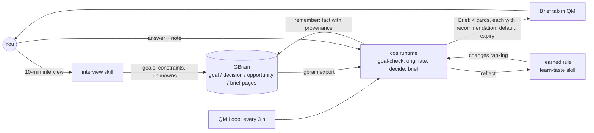

# Chief of Staff: the goals layer for GBrain and QM

**GBrain remembers what you know. QM does the work. Chief of Staff owns what you want, and brings you the few decisions only you can make.**

Built at the YC "Own Your Intelligence" hackathon (2026-09-27) on [GBrain](https://github.com/garrytan/gbrain) and [QM](https://github.com/yc-software/qm). QM fork with the Brief tab: [RRaphaell/qm, branch `chief-of-staff`](https://github.com/RRaphaell/qm/tree/chief-of-staff).

## Architecture



## The learning loop

1. You answer a card (done, skip, or a note).
2. The answer is written to GBrain as a fact with provenance (`gbrain call remember`), and the decision page is updated.
3. **Reflect** reads the recent answers and writes a learned rule (for example "rank reply-to-post cards lower").
4. The next run ranks cards with that rule, so the Brief changes.

The loop takes the Reflexion idea (verbal feedback stored as memory) and applies it to ranking a person's day, not to one task.

## Quick start

```bash
# 1. GBrain (install: https://github.com/garrytan/gbrain), then load the seed brain
export PATH=$HOME/.bun/bin:$PATH
cd ~/hack && gbrain init && gbrain import seed/   # goals, people, projects, decisions, notes
# 2. The goals schema pack (types goal, decision, opportunity, brief): chief-of-staff/schema/pack.yaml
#    Skills: chief-of-staff/skills/*/SKILL.md
# 3. Seed format: markdown + YAML frontmatter in seed/{goals,people,projects,decisions,notes}/
# 4. The cos runtime (stdlib Python, no deps)
python3 chief-of-staff/cos/cos.py run                  # print today's Brief
python3 chief-of-staff/cos/cos.py serve                # Brief page on http://127.0.0.1:8790
python3 chief-of-staff/cos/cos.py answer <id> skip --note "why"
python3 chief-of-staff/cos/cos.py reflect              # answers -> learned rules
# 5. QM with the Brief tab
git clone -b chief-of-staff https://github.com/RRaphaell/qm && cd qm && npm ci && npm run dev
# open the web UI, then Brief in the sidebar (or Browse -> Brief); the web-ui server proxies
# the cos runtime same-origin under /cos/ (set COS_URL to point elsewhere)
```

GBrain on PGLite is single-writer: run one `gbrain` process at a time. The runtime queues its writes for that reason.

## What is new, what we reuse

| New (this project)                                                          | Reused                                     |
| --------------------------------------------------------------------------- | ------------------------------------------ |
| `chief-of-staff` schema pack: goal, decision, opportunity, brief page types | GBrain storage, `put`, `remember`          |
| Six skills: interview, goal-check, originate, decide, brief, learn-taste    | QM harness, chat, sandbox, skills runtime  |
| cos runtime: ranking, Brief, answers, reflect, learned rules                | Claude (headless) for ideas and reflection |
| Brief tab in the QM web UI; a QM Loop definition (every 3 h)                | QM Loops and plugin shell                  |
| Privacy filter: people cards and private goals are never shown              |                                            |

## Related work

- **Reflexion** ([arXiv 2303.11366](https://arxiv.org/abs/2303.11366)): agents improve from verbal feedback kept in memory. We take the feedback-to-memory step and use it for ranking.
- **Generative Agents** ([arXiv 2304.03442](https://arxiv.org/abs/2304.03442)): a memory stream plus periodic reflection into higher-level insights. We take the reflect step that turns many answers into one rule.
- **Voyager** ([arXiv 2305.16291](https://arxiv.org/abs/2305.16291)): a growing library of skills learned from experience. We take the idea that learned behaviour is stored as reusable, readable artifacts (rules written into the brief skill).

## Honest limits

- Tested on one person's data: 443 real decisions from one Personal OS. No other users yet.
- Reflect is simple: it groups answers by card kind, post author and words in your notes, and writes a rule once a group reaches 2 answers (demo mode) or 3. It has no guard against learning a wrong rule from a few answers.
- The runtime reads the brain with one `gbrain export` at start and on reset, not per request through `recall`/`search`; answers, learned rules and interview pages go back through GBrain's write verbs. Goal progress comes from simple keyword matching on decisions.
- The QM Loop (every 3 h) and the GBrain memory-provider example are config examples; during the hackathon the loop was run by hand, not on a schedule.
- GBrain on PGLite allows one writer, so answers are written through a queue and can lag by a few seconds.
- The privacy filter is a keyword list. It hides people cards and private goals in the demo, but it is not a guarantee.
